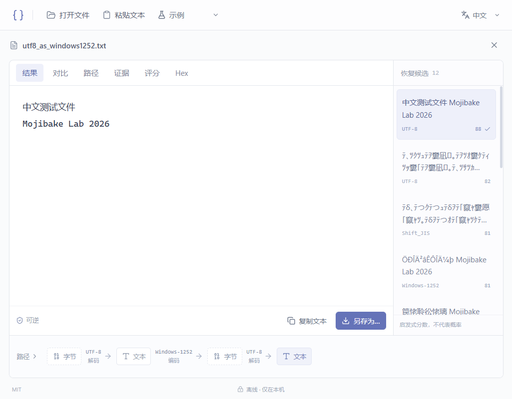

# Mojibake Lab · 乱码尸检室

**Encoding went wrong. Find out where.**

简体中文 · [English](README.en.md)

一个轻巧、完全离线的字符编码取证工具。打开文件或粘贴乱码，查看恢复候选和每一步转换。采用简洁浅色界面，默认 English，可切换简体中文和日本語，并记住选择。

<!-- Screenshots are captured from the real desktop application. -->


## 使用

从 **[Releases 下载最新版](https://github.com/cabal312512/MojibakeLab/releases/latest)**。

| 平台 | 下载格式 |
| --- | --- |
| Windows 10/11 x64 | 单文件 `portable.exe`、便携 `portable.zip`、安装版 `setup.exe` |
| macOS 11+，Apple Silicon / Intel | 通用版 `.dmg`、`.app.zip` |
| Linux x64 | `.AppImage`、`.deb`、`.tar.gz` |
| 源码 | `source.zip`，以及 GitHub 自动生成的源码包 |

Windows 推荐单文件便携版：只下载一个 EXE，放入可写文件夹后双击即可。系统需已有 Microsoft Edge WebView2 Runtime；程序不会自动安装或联网下载运行时。运行后会生成同目录 `runtime-data`，开源许可已内嵌，可点击窗口底部 **MIT** 查看。

从本地源码构建后，也可双击项目根目录的 **MojibakeLab.cmd** 或运行 `release/MojibakeLab/MojibakeLab.exe`。发布包的 `SHA256SUMS.txt` 可用于校验下载完整性。Windows 构建未签名，macOS 使用临时签名但未经 Apple 公证，首次打开可能需要系统确认。

1. 在首页直接输入乱码、粘贴文本或拖入文件。也可以打开内置示例。
2. 选择候选，查看恢复文字和底部的转换路径；需要时展开详细步骤。
3. 在「对比」「Hex」「评分」中核对结果，再复制或另存为 UTF-8。

`Ctrl/Cmd+O` 打开文件；输入框内 `Ctrl/Cmd+Enter` 开始分析。

**恢复结果永远写入新文件。** 即使在保存对话框选择了原文件或任何已存在文件，后端也会拒绝覆盖。

## 为什么会乱码

`中文` 的 UTF-8 字节是 `E4 B8 AD E6 96 87`。如果按照 Windows-1252 解码，就会得到 `中文`。先把乱码按 Windows-1252 编码回字节，再按 UTF-8 解码，可以恢复 `中文`。

```
中文  ── encode Windows-1252 ──▶  E4 B8 AD E6 96 87
                                      │ decode UTF-8
                                      ▼
                                     中文
```

这是一条可验证的恢复路径，不代表程序知道文件真实经历过什么。多个转换路径可能得到同样合理的文字。

## 支持与边界

- UTF-8（含 BOM）、UTF-16 LE/BE、GBK、GB18030、Big5、Shift_JIS、EUC-JP、EUC-KR、Windows-1252 和严格 Latin-1 字节语义。
- 所有转换都区分 Unicode 文本和字节；UTF-16 编码与 Latin-1 有独立、可测试的实现。其余映射遵循 `encoding_rs` / WHATWG，未宣称等同所有历史操作系统代码页或 GB18030 标准版本。
- 检测器只是线索。评分是启发式分数，**不是恢复概率**。文字可往返转换，也不代表语义一定正确。
- `�` 可能表示上游已经丢弃原始字节。工具会提示信息丢失，不能凭空恢复被丢弃的字符。普通问号不自动视为损坏。
- 正常 UTF-8 文本优先保留。脚本分布仅作为弱证据，不把“汉字更多”当成正确答案。
- 二次乱码在最多三轮恢复中搜索；每轮保留十二个状态，限制总状态、转换次数和输出大小，并合并重复文本。
- 文件超过 32 KiB 时分析已对齐字符边界的头部，另取中部、尾部检查 UTF-8 有效性和常见二进制标记。界面明确标记抽样，只有另存时才以流式转换验证完整文件。若后续遇到无法无损处理的字节，导出失败并清除部分输出。抽样不能排除不同片段混用编码，也不能自动可靠修复此类文件。
- 粘贴上限 32 KiB；更大的内容请作为文件打开。Hex 每次最多读取 4 KiB。
- 对常见二进制签名和异常控制字节做拦截；不是二进制格式解析器。仅处理单个纯文本文件，不提取 PDF/Word/Excel。

## 离线与便携

应用不包含账号、AI 服务、遥测、更新检查或远程字体。生产页面 CSP 限制网络访问，导航只允许应用本地页面。文件处理全部在 Rust 中进行，证据不上传。

Windows 便携版的应用设置、WebView 数据和临时文件位于程序旁边的 `runtime-data`；使用根目录启动脚本时位于项目根目录。应用不修改系统 PATH、注册表或默认程序。操作系统和系统 WebView 自身管理的日志、文件选择器历史等不属于应用可完全控制的范围。

macOS 使用 `~/Library/Application Support/MojibakeLab`；Linux 使用 `$XDG_DATA_HOME/mojibake-lab` 或 `~/.local/share/mojibake-lab`，避免向只读 AppImage 或已签名的应用包写入。可以用 `MOJIBAKE_DATA_DIR` 指定其他数据目录。Windows 安装包提供正常的安装和卸载流程，与免安装 EXE 区分。

构建工具、npm/Cargo 依赖、下载和构建缓存均保留在本项目的 `.tools`、`.cache`、`.tmp`、`node_modules` 和 `target` 下；不需要将这些目录提交到 GitHub。

## 开发

技术栈：Tauri 2、Rust、React 19、TypeScript、Vite。编码逻辑独立于桌面壳，可以单独测试。

```
crates/mojibake-core/   编码、证据、评分、搜索、算法测试
src-tauri/             原始文件 IO、流式导出、Tauri 命令和窗口
src/                   多语言界面、图、预览、对比和 Hex
tests/fixtures/        可重现编码样本
scripts/               便携工具链、构建、验证、许可证整理
docs/                  架构设计和截图
```

Windows，在项目 PowerShell 中：

```powershell
# 首次准备工具链（需要下载；只写项目目录）
powershell -ExecutionPolicy Bypass -File scripts/toolchain.ps1
. ./scripts/env.ps1
npm.cmd ci
npm.cmd run desktop:dev

# 验证并生成便携应用
powershell -ExecutionPolicy Bypass -File scripts/build.ps1
```

已有常规开发环境的 macOS/Linux：安装官方 Tauri 系统前置依赖后，运行 `npm ci`、`npm run desktop:dev`。Windows 本地便携脚本不适用于其他系统。三平台 CI 会检查源码并生成可执行文件；本次交付只在 Windows 上实际运行验证。

```sh
npm run typecheck
npm test
npm run build
cargo test --workspace --locked
cargo check --workspace --locked
cargo fmt --all --check
npm run desktop:build
```

[实现设计](docs/ARCHITECTURE.md) · [验证记录](docs/VALIDATION.md) · [第三方软件](THIRD_PARTY_NOTICES.md) · [MIT License](LICENSE)

## 发布到 GitHub

源码和锁文件可直接提交；`.gitignore` 已排除本地工具链、依赖、缓存、用户数据和编译输出。不要把 `.tools` 中的 Microsoft SDK/compiler 打包上传。发布 Windows 便携版时压缩 `release/MojibakeLab`，保留许可证文件，排除 `runtime-data`。当前版本未做代码签名；其他平台的发布包需在对应平台构建和验证。

正式发布使用 [Release 工作流](.github/workflows/release.yml)：更新 `.github/release-plan.json` 时自动触发，也可手动运行或推送版本标签。三个平台完成测试和打包后，生成源码包及 SHA-256 校验文件，先上传草稿，资产齐全后再公开 Release。已公开版本不会被工作流覆盖。发布说明位于 `docs/releases/`。
